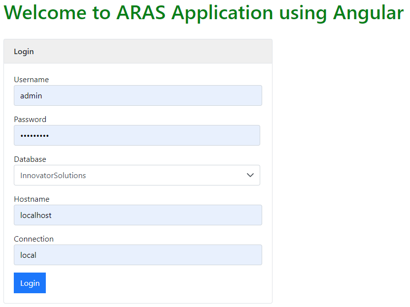
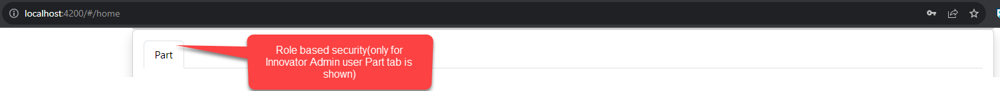
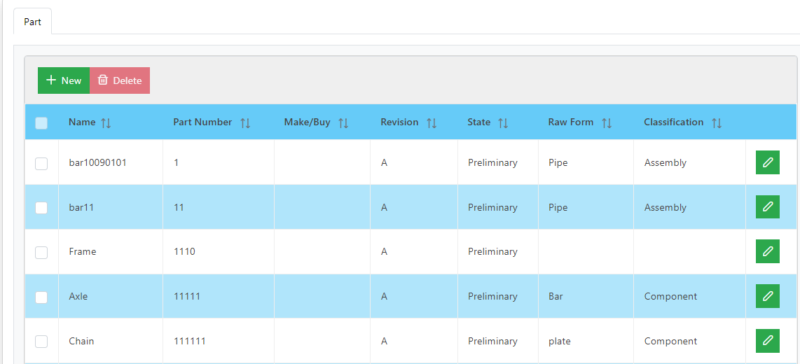
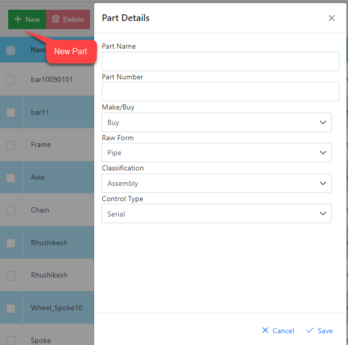
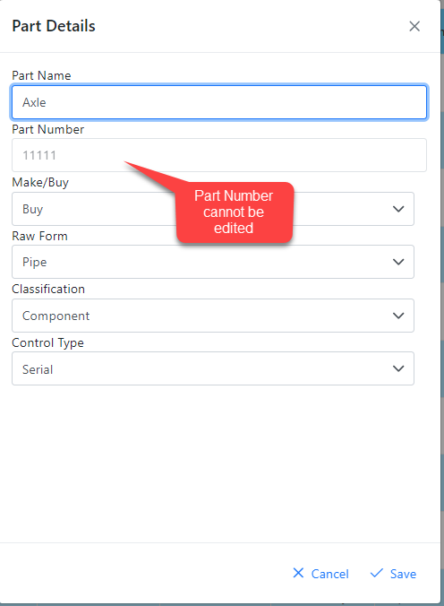

# Welcome to Aras Application based on Angular UI and DOTNET Core Web API using Innovator Admin client library

The application is based on the popular Angular UI framework that integrated with REST APIs published using DOTNET CORE Web API. 

# Architecture

Angular UI connects with dotnet core APIs using REST.
The dotnet core APIs connect to the ARAS PLM platform using Innovator Admin client library.

## Part Management (CRUD)

The application tries to manage a Part using the above architecture for the following.
1. Create Part
2. Delete Part
3. Edit Part
4. Role based security for UI

## Role  based Security

The user roles will allow the logged in user to access a particular functionality.
Example : Delete Part is accessible only to Innovator Admin user.

## Use Case 1 - Login

## Use Case 2 - Home Page based on Role based Security

## Use Case 3 - Get All Parts

## Use Case 4 - Create Part

## Use Case 5 - Edit Part

